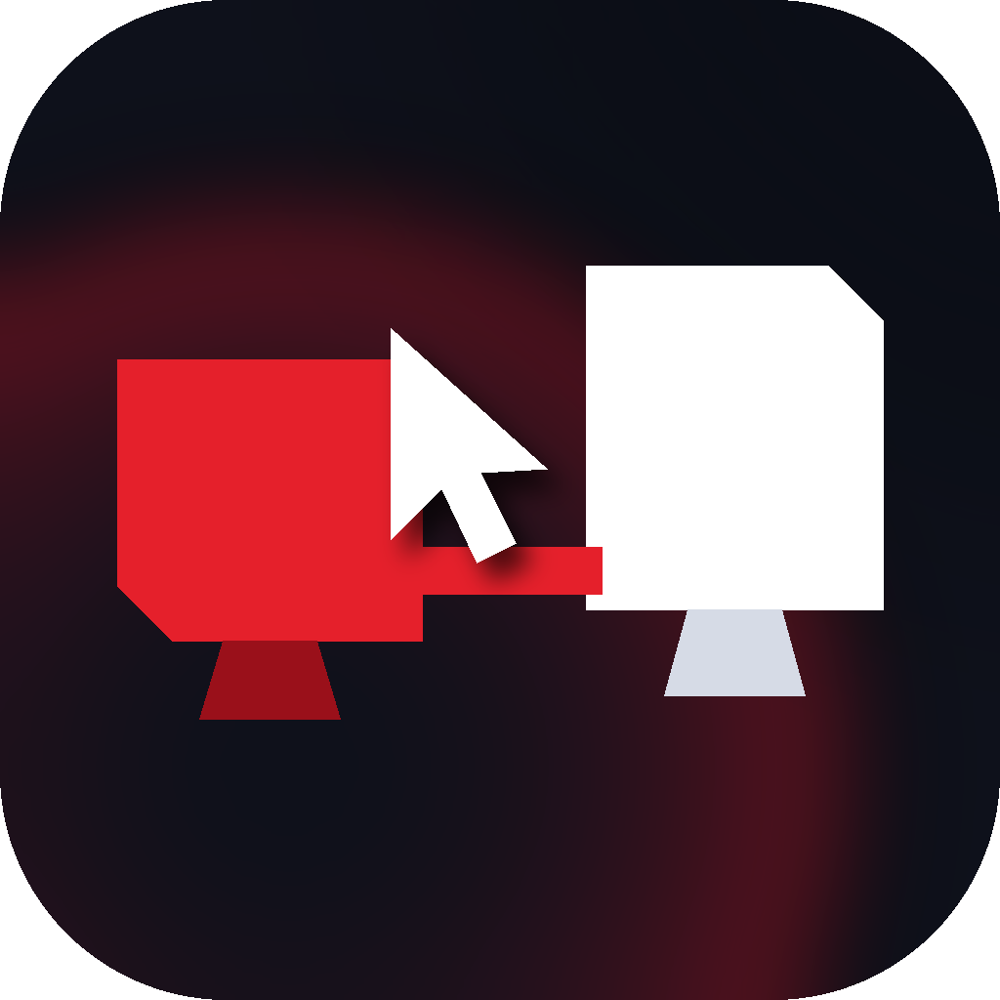

<div align="center">



# CaYaScreenBridge

**A Windows utility that keeps the mouse cursor physically aligned across displays with different DPI.**

**English** · [Türkçe](README.tr.md)

</div>

---

## The problem

Windows sees every display as nothing but a rectangle of pixels. A 27" 4K panel and a 24" Full HD
panel are almost the same height in pixels but nothing like it in real life. When the cursor crosses
the boundary it keeps its pixel row, so it reappears at a completely different height on your desk —
leave the middle of the 4K screen and you arrive at the bottom of the one beside it.

CaYaScreenBridge maintains **a second position in millimetres** alongside the pixel one, solves every
movement in that physical space, and converts back to pixels only at the very end.

## What it does

| | |
|---|---|
| **Physical alignment** | The cursor keeps its real height on the desk when it changes screen. |
| **Trajectory aware** | The destination is chosen from the path the movement took, not from where it happened to end. A fast diagonal flick lands on the screen it actually crossed. |
| **Edge assisted crossing** | When Windows pins the cursor to the edge of the desktop, the rest of the movement is reconstructed from raw HID data. This is what makes crossings into a physically adjacent but pixel offset display reliable. |
| **The cursor is never lost** | A movement ending in the dead space of an L shaped layout is projected onto the nearest display in the direction of travel. |
| **Window dragging** | A window is rescaled the moment it crosses a DPI boundary so it keeps its real size, and the point you grabbed stays under the pointer. |
| **Games and full screen** | Exclusive full screen, borderless full screen and anti-cheat are each detected separately, and the application gets out of the way when it should. |
| **It repairs itself** | A dropped hook is reinstalled; sleep, session lock, display changes and a corrupt configuration file each have their own recovery path. |
| **Visual layout editor** | Displays are arranged by dragging them at their true relative sizes, in millimetre space. |

## Installing

**Installer** — download `CaYaScreenBridge-x.y.z-setup.exe` from the
[Releases](https://github.com/CaYatur/CaYaScreenBridge/releases) page.

**Portable** — download the `-portable-win-x64.zip` archive from the same page, extract it and run
`CaYaScreenBridge.exe`. No .NET installation is needed; the package carries its own runtime.

Requires Windows 10 version 1809 (10.0.17763) or later, x64.

### Starting with Windows

The application registers its own logon task through **Task Scheduler**. That is a deliberate choice:
a low level mouse hook installed by a standard user process is ignored while an elevated window has
focus. In other words, correction would silently stop working over a game launched as administrator,
or over Task Manager. A logon task grants those rights without a UAC prompt at every sign in.

There are three layers of fallback — the Task Scheduler COM interface, the `schtasks` command line,
and finally the `HKCU\...\Run` key. The registration is verified on every start and rewritten if the
path has drifted (an update, a moved folder).

## How it works

### The coordinate model

Every display is represented by two rectangles: the pixel one Windows uses, and a millimetre one
describing where the panel really sits on the desk. The physical size comes from **EDID** (the real
dimensions the panel reports), falls back to a DPI estimate, and can be corrected by hand in either
case.

```
millimetres = physicalOrigin + (pixel - pixelOrigin) / pixelsPerMm
```

The layout is reconstructed in millimetre space while preserving the neighbour relationships from the
Windows display settings: panels that touch in pixel space touch in millimetre space too, and the
proportional offset along the shared edge is kept.

### The transition solver

For every mouse movement:

1. If the movement stays on the source display nothing happens — this is the overwhelming majority of
   events, and it costs one rectangle test.
2. If it leaves, the movement is converted into millimetre space and the destination is computed.
3. If the destination lands on a display, done.
4. If not, the movement is intersected **as a line segment** with the whole layout; the first display
   along the path is chosen and the position is clamped onto it. This is how a fast movement across a
   narrow panel still lands correctly.
5. Failing that, wrapping is tried when enabled.
6. Failing that, the position is projected onto the nearest display in the direction of travel.
   **The cursor is never left in dead space.**

The authoritative position is the millimetre one, and it is **never re-derived from the rounded
pixel position**. Crossing a border back and forth a thousand times therefore returns the cursor to
where it started; rounding error does not accumulate. There is a test in this repository that
verifies exactly that over a thousand crossings.

### Edge assisted crossing

When Windows pins the cursor against the outer edge of the desktop, the low level hook keeps firing
but the reported position stops changing — the intent becomes invisible. Raw input (`WM_INPUT`) keeps
delivering the true device delta throughout. That delta is in device units, though, with pointer
acceleration in between.

The application does not try to reimplement the acceleration curve. While the cursor is moving
freely it learns the ratio between the raw delta and the actual pixel movement in **three speed
buckets** (acceleration is velocity dependent, so a single average would not do), and applies the
learned ratio only to the axis that is currently blocked.

### Window dragging

When a drag starts, the window's physical size and the proportional position of the grab point are
captured. When the window crosses a DPI boundary, the target rectangle is solved from those two
values.

Two details make this work in practice:

- The rectangle is **re-applied** shortly after each boundary crossing. A DPI aware application
  receives `WM_DPICHANGED` after our `SetWindowPos` and resizes itself to a size of its own choosing;
  the delayed second pass puts our measurement back.
- Every `SetWindowPos` is issued off the input thread. Writing to another process' window from
  inside a hook callback means blocking for as long as that process takes — and that is the classic
  way to get a hook dropped by Windows.

DPI unaware windows are skipped by default: Windows bitmap stretches them, and resizing one from the
outside produces a blurry, mispositioned result.

> **Note:** cursor alignment works fully while dragging a file from the desktop, but the translucent
> drag image is drawn by OLE at the source DPI and cannot be rescaled from outside the process. The
> drop itself lands in the right place.

### Games and full screen

| Situation | Default |
|---|---|
| Direct3D exclusive full screen | Pause — the cursor is already confined to one display, so there is nothing to gain and something to lose |
| Borderless full screen | Correct the cursor, never resize the window |
| Anti-cheat running | Stand down completely — injected cursor movement can be read as automation |
| Application rule | One of three behaviours, matched on the process name |

The anti-cheat check overrides even an explicit rule. The cost of being on the wrong side of that is
paid by the user's account, not by this application.

### Reliability

The real test of a tool like this is whether it still works three weeks and forty sleep cycles later.

- **The hook lives on its own thread.** A `WH_MOUSE_LL` callback runs on the thread that installed
  the hook, and Windows drops hooks that overrun `LowLevelHooksTimeout` without telling anyone. If
  the hook lived on the UI thread, a slow XAML layout pass or a modal dialog would be enough to
  silently disable the application.
- **A watchdog.** There is no API that asks whether a low level hook is still in the chain. The one
  reliable signal is a contradiction: the cursor has visibly moved, yet no event reached the
  callback. That can only mean the hook is gone, and when it is detected the hook is reinstalled.
- **System events.** Resume from sleep, session lock and unlock, fast user switching and display
  topology changes each have their own recovery path. Display changes are debounced, because Windows
  raises that event several times while the layout settles.
- **Configuration.** Writes go through a temporary file and are swapped in atomically while the
  previous good copy is kept as a backup; a corrupt file is recovered from that backup rather than
  silently reset.
- **Hook timeout.** `LowLevelHooksTimeout` is optionally raised. The callback is far under that
  budget in normal operation, but a machine stalling under heavy load can still trip it, and the
  user experiences that as "the application randomly stopped".

## Configuration

Settings live in `%LOCALAPPDATA%\CaYaScreenBridge\config.json`. Logs are in the `logs` folder beside
it and are pruned after seven days.

The display calibration is stored as a **profile**, keyed by the set of attached displays. Docking
the same laptop into two different setups lets each keep its own calibration.

The interface language follows Windows: Turkish when the system is Turkish, English otherwise. It can
be overridden in the settings.

## Building from source

```bash
git clone https://github.com/CaYatur/CaYaScreenBridge.git
cd CaYaScreenBridge

dotnet build CaYaScreenBridge.sln -c Release
dotnet test tests/CaYaScreenBridge.Core.Tests
```

WPF only compiles on Windows. The core library (`CaYaScreenBridge.Core`) targets platform
independent `net8.0`, and the whole algorithm lives there, so the tests run anywhere.

To regenerate the icon:

```bash
pip install Pillow
python3 build/icon/generate_icon.py
```

## Project layout

```
src/CaYaScreenBridge.Core/          Platform independent core
  Geometry/                         Vectors, rectangles, segment/rectangle intersection
  Model/                            Display model, millimetre layout, EDID parsing
  Algorithm/                        Transition solver, raw delta calibration, drag solver, policy
  Config/                           Configuration model and resilient storage
src/CaYaScreenBridge.Windows/       Windows layer and interface
  Native/                           P/Invoke declarations
  Platform/                         Monitor enumeration, EDID registry lookup
  Engine/                           Hook thread, foreground watcher, dragging, orchestration
  Services/                         Startup registration, single instance, file logging
  Ui/                               WPF interface, tray icon, layout editor
tests/CaYaScreenBridge.Core.Tests/  Algorithm tests
```

## Contributors

- **[CaYatur](https://github.com/CaYatur)** — project owner, design direction and requirements

## License

MIT — see [LICENSE](LICENSE).

<div align="center">
<sub><a href="https://cayadev.com">cayadev.com</a></sub>
</div>
